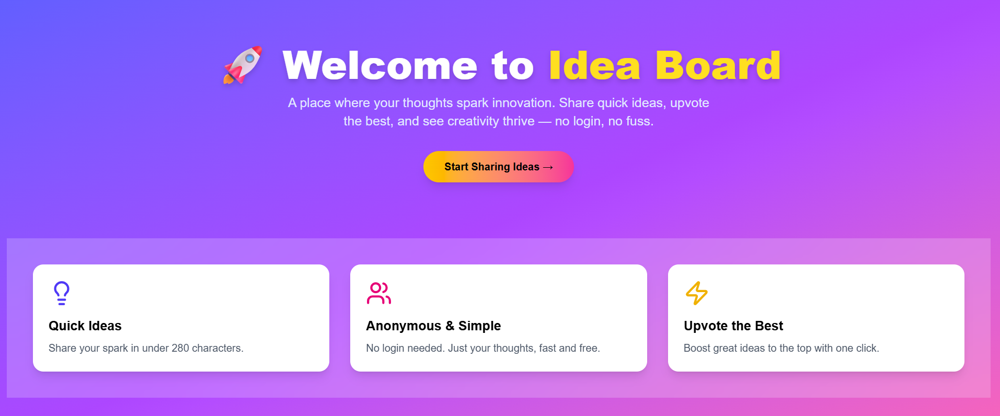
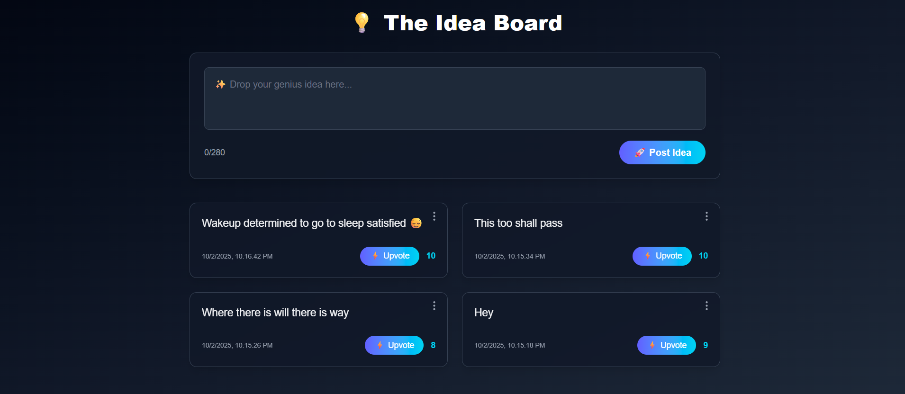

## 🎥 Demo

### 🏠 Landing Page


### 💡 Idea Board App


# 💡 Idea Board

A full-stack web application with a marketing landing page and a connected "Idea Board" mini-app.  
Built with **Next.js, Tailwind CSS, Express, Prisma, PostgreSQL, and Docker**.

---

## 🚀 Overview

- **Landing Page**:  
  - Hero section with CTA  
  - Features section (Quick Ideas, Anonymous & Simple, Upvote the Best, Fully Responsive)  
  - Modern responsive design  

- **Idea Board App**:  
  - Post ideas (max 280 chars)  
  - Upvote ideas  
  - Delete ideas (with confirmation)  
  - Auto-refresh every 5s for live updates  
  - Toast notifications (success/error)  

- **Persistence**:  
  - Ideas stored in PostgreSQL using Prisma ORM  

- **Deployment**:  
  - Fully containerized with Docker + Docker Compose  

---

## 🛠 Architecture

- **Frontend**: Next.js (App Router) + Tailwind CSS  
- **Backend**: Node.js (Express) + Prisma ORM  
- **Database**: PostgreSQL (Dockerized)  
- **Containerization**: Docker & Docker Compose  
- **Styling**: Tailwind CSS with gradients + glassmorphism  
- **UX Features**: Toasts, responsive UI, polling for live updates  

---

## 🐳 Run Locally with Docker Compose

### 1. Clone Repo
```bash
git clone https://github.com/<your-username>/idea-board.git
cd idea-board
